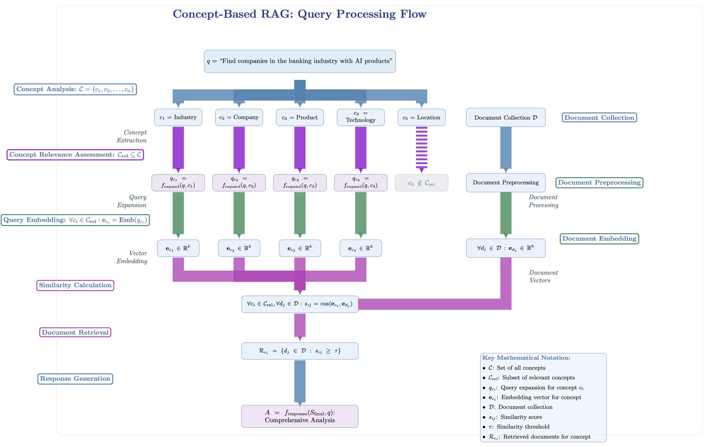

# Datathon 2025: RAG-Orderfox Challenge Solution

A powerful Retrieval-Augmented Generation (RAG) system developed for the Datathon.ai hackathon 2025 Orderfox challenge. This project implements semantic search across large document datasets to retrieve and synthesize information in response to user queries.




## What is RAG?

Retrieval-Augmented Generation (RAG) is an AI architecture that enhances large language models (LLMs) with the ability to access and use external knowledge. Unlike traditional LLMs that rely solely on their training data, RAG systems:

1. **Retrieve** relevant information from a knowledge base when given a query
2. **Augment** the LLM's context with this retrieved information
3. **Generate** responses that incorporate both the model's inherent knowledge and the retrieved information

This approach addresses hallucination issues in LLMs and allows the model to access up-to-date, specific information that may not have been part of its training data.

## Features

- **Dual RAG Agent Architecture**:
  - `rag_agent.py`: Advanced agent with concept expansion and multi-stage reasoning
  - `rag_basic_agent.py`: Baseline RAG agent for direct semantic search
  
- **Interactive UI Interface**: User-friendly chat interface built with Gradio
  
- **Advanced Semantic Processing**:
  - Prompt expansion for concept discovery
  - Semantic search for content retrieval
  - Multi-stage answer synthesis
  
- **Conversational Follow-ups**: Maintain context for follow-up questions without re-processing data

- **Customizable Concept Framework**: 
  - Define domain-specific concepts relevant to your business
  - Tailor the system to focus on concepts that matter to your use case
  - No need to re-embed documents when changing concept definitions

## How the System Works

### Core RAG Process

1. **Embedding Generation**: Documents are pre-processed into semantic embeddings
2. **Query Processing**: 
   - The advanced agent expands queries into multiple concept-specific versions
   - The basic agent uses direct semantic matching
3. **Retrieval**: 
   - Locate relevant content using cosine similarity between query and document embeddings
   - Group results by source domains
4. **Answer Generation**:
   - Extract and process relevant content
   - Synthesize information into coherent responses with source attribution
   - Maintain conversation context for follow-up questions

### Advanced vs Basic Agent

- **Advanced Agent** (`rag_agent.py`): Uses prompt expansion to explore multiple conceptual angles of a query, generating intermediate answers from each source before creating a comprehensive final response.

- **Basic Agent** (`rag_basic_agent.py`): Takes a more direct approach with single embedding comparison, retrieving all pages from matching domains for a broader but potentially less focused response.

### Business-Driven Concept Customization

A key advantage of our concept-based RAG approach is that organizations can:

1. **Define Industry-Specific Concepts**: Customize the concept dictionary to focus on dimensions important to your industry
2. **Maintain Document Scalability**: The document embedding process remains independent of concept definitions, preserving scalability
3. **Optimize at Inference Time**: Gain the benefits of conceptual search without additional preprocessing costs
4. **Evolve Without Reprocessing**: Update concept definitions without re-embedding your document collection

This provides the perfect balance between cost-effective document processing and high-precision information retrieval.

For a detailed technical explanation of our concept-based RAG approach and how it improves upon traditional RAG systems, see [TECHNICAL_DETAILS.md](TECHNICAL_DETAILS.md).

## Getting Started

### Prerequisites

- Python 3.11+
- PyTorch
- Sentence Transformers
- OpenAI API key
- Gradio (for UI)
- Pandas, NumPy, tqdm
- **Orderfox Challenge Dataset**: This project requires the specific dataset provided by [Orderfox](https://www.orderfox.com) for the Datathon 2025 challenge

### Data Preprocessing

Before using the system, you must generate the document embeddings:

1. Place the Orderfox-provided challenge dataset in the project directory
2. Run the preprocessing script to create embeddings from your data:
   ```bash
   python preprocessing.py
   ```

   This script:
   - Loads the raw document data from the Orderfox dataset parquet file
   - Computes semantic embeddings using Sentence Transformers
   - Segments the data into manageable chunks
   - Saves the processed data as parquet files with embedding vectors

   Note: The preprocessing can take significant time depending on your dataset size and hardware capabilities.

### Concept Customization

To customize the system for your specific needs:

1. Edit the concept dictionary in `rag_agent.py` to focus on aspects most relevant to your business
2. No need to reprocess your document embeddings - changes take effect immediately
3. Test with domain-specific queries to fine-tune your concept definitions

### Running the UI

Launch the user interface with:

```bash
python rag_ui.py
```

The UI provides:
- Input field for your query
- Real-time status updates
- Response display
- Chat history for follow-up questions

### Configuration

Key parameters can be adjusted in the agent files:
- `num_tokens_prompt_expansion`: Controls detail in concept exploration
- `num_tokens_intermediate_answer`: Limits intermediate processing steps
- `num_tokens_final_answer`: Sets maximum response length
- `max_good_subpage_links`: Controls breadth of source retrieval
- `concept_dict`: Define the business-specific concepts to enhance search relevance

## Data Structure

The system works with document embeddings stored in parquet files with the following schema:
- `home_url`: Source domain
- `page_url`: Specific page URL
- `text`: Document content
- `embd_vector`: Pre-computed semantic embedding vector

## Acknowledgements

- Built for the Datathon.ai 2025 RAG-Orderfox challenge
- Dataset provided by [Orderfox](https://www.orderfox.com), the world's largest AI-powered CNC network and B2B Chatbot provider
- Powered by:
  - Sentence Transformers
  - OpenAI API
  - Gradio UI framework
