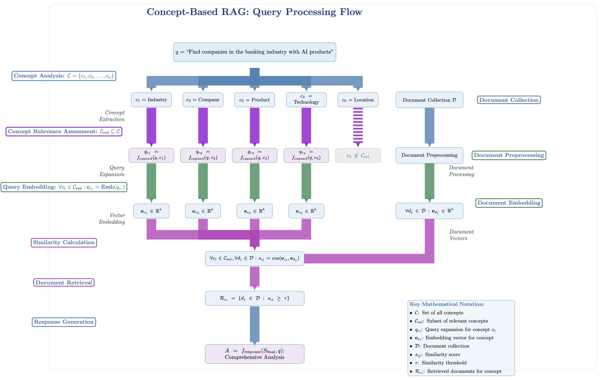
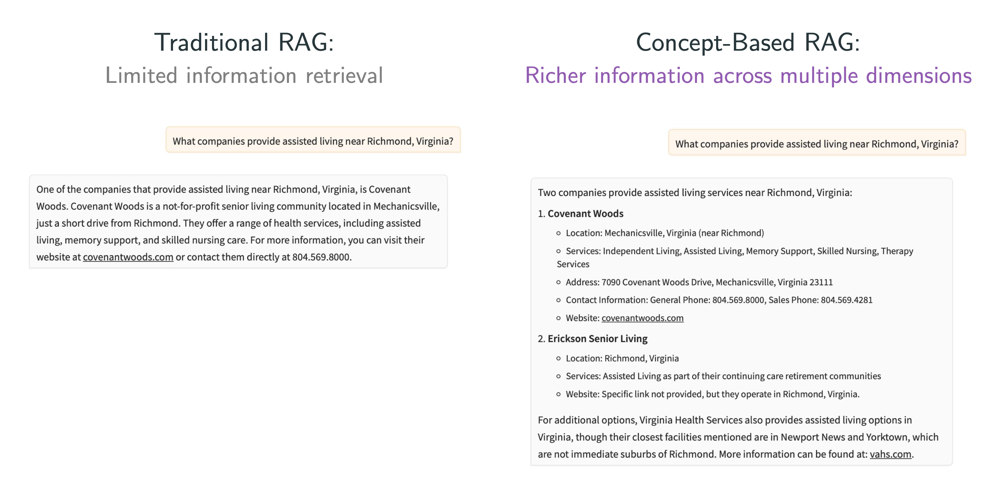

# Concept-RAG: Technical Deep Dive

Our system implements a concept-based RAG approach that improves upon traditional RAG systems in several key ways:

## 1. Concept-Driven Query Expansion

**Advantages:**
- **Semantic Breadth**: Unlike standard RAG that uses only the original query for embedding search, our system analyzes the query across multiple conceptual dimensions (location, industry, product, etc.)
- **Improved Recall**: By creating multiple semantically-expanded versions of the query, we increase the chances of finding relevant content that might use different terminology
- **Contextual Understanding**: The LLM expands the original query based on its understanding of each concept, incorporating domain knowledge
- **Customizable for Domain Expertise**: Organizations can define concepts specific to their industry, tailoring the system to their unique needs without changing the underlying document embeddings

**Design Choice Rationale:** 
Traditional RAG often misses relevant documents when the query terminology differs from document terminology. Our concept expansion creates multiple semantic "search paths," dramatically improving recall without sacrificing precision. By decoupling concept definitions from document embedding, we enable organizations to inject domain expertise at inference time without expensive reprocessing of documents.

## 2. Multi-Vector Semantic Search

**Advantages:**
- **Parallel Semantic Matching**: Each concept-expanded query creates its own embedding vector, allowing parallel semantic comparison against the document corpus
- **Higher Quality Matches**: By using multiple query vectors, we can find more precise matches for specific concepts in the documents
- **Dimensional Coverage**: Different expanded vectors capture different semantic dimensions of the query intent
- **Inference-Time Optimization**: The embedding matrices for documents remain unchanged while concept-specific search operates at query time, preserving scalability

**Design Choice Rationale:**
Standard RAG uses a single embedding vector, which forces a compromise between different semantic aspects of the query. Our multi-vector approach allows each concept to be independently matched, significantly improving retrieval quality. This architecture also provides a critical separation between the expensive document embedding process (done once) and the concept-driven search (done at inference), making the system both powerful and cost-efficient.

## 3. Domain-Based Document Clustering

**Advantages:**
- **Entity-Centric Approach**: Documents are clustered by domain (company/organization), ensuring coherent information extraction
- **Comprehensive Coverage**: The system retrieves additional pages from the same domains to gain broader context
- **Homepage Prioritization**: The system ensures that domain homepages are included for context, providing foundational information
- **Industry-Aware Organization**: When concepts are tailored to specific industries, document clustering becomes more aligned with business entities

**Design Choice Rationale:**
Traditional RAG often retrieves scattered documents without contextual relationships. Our domain clustering approach ensures that information about a single entity is processed together, resulting in more coherent and comprehensive answers. This is particularly valuable when concept definitions are customized for specific business domains.

## 4. Two-Stage Answer Synthesis

**Advantages:**
- **Hierarchical Reasoning**: The system first analyzes each domain's content independently, then synthesizes across domains
- **Information Validation**: The two-stage process allows cross-checking information between sources
- **Source Attribution**: The system maintains source tracking throughout, ensuring transparency
- **Content Prioritization**: The final synthesis can weigh and rank information based on relevance to the original query
- **Concept-Aware Summarization**: When using domain-specific concepts, the system better understands what aspects to highlight in each answer

**Design Choice Rationale:**
Standard RAG often struggles with long document contexts and contradictory information. Our two-stage synthesis breaks down the reasoning process into manageable chunks, allowing deeper analysis of each source before integration, similar to human research processes. The quality of intermediate answers improves dramatically when the concepts guiding retrieval align with the organization's specific information needs.

## 5. Comparative Analysis with Baseline RAG

The repository includes both advanced and basic RAG implementations to demonstrate the advantages:

| Feature | Basic RAG | Concept-RAG |
|---------|-----------|-------------|
| Query Processing | Single query vector | Multiple concept-expanded vectors |
| Document Retrieval | All pages from top domains | Selectively retrieved pages per domain |
| Context Processing | Direct dump of retrieved content | Hierarchical domain-specific analysis |
| Answer Generation | One-step synthesis | Two-stage hierarchical synthesis |
| Memory Usage | Higher (all domain pages) | More efficient (selective retrieval) |
| Answer Quality | Good recall, lower precision | High recall and precision with better organization |
| Customizability | Limited | Extensive through concept definitions |
| Preprocessing Cost | One-time embedding | Same one-time embedding cost |
| Inference Cost | Lower | Slightly higher but with much better results |
| Domain Expertise | Cannot incorporate | Easily incorporated through concepts |

The basic agent demonstrates how a conventional RAG would handle the same data, allowing direct comparison of results and performance.

## Implementation Differences Between Advanced and Basic Agents

### Advanced RAG Agent
The advanced agent (`rag_agent.py`) performs these steps:
1. Expands the original query into concept-specific queries using LLM-powered prompt expansion
2. Embeds all expanded queries to create multiple semantic vectors
3. Retrieves top matching documents for each query vector
4. Selectively retrieves additional pages from the same domains for context
5. Generates intermediate answers for each domain separately
6. Synthesizes a final answer by combining and prioritizing the intermediate answers

### Basic RAG Agent
The basic agent (`rag_basic_agent.py`) follows a simpler approach:
1. Directly embeds the original query without expansion
2. Retrieves top matching documents based on single vector similarity
3. Retrieves all pages from the matched domains
4. Passes all retrieved content directly to the LLM for processing
5. Generates a single answer in one step

This comparison highlights how the architectural choices in the advanced agent lead to more precise, comprehensive, and well-structured responses.

## Cost-Benefit Analysis of Concept Customization

A key advantage of our approach is the separation between document processing and concept definition:

### Traditional RAG Cost Structure:
- **High Preprocessing Cost**: Document embedding is computationally expensive
- **Fixed Search Behavior**: Search parameters are difficult to modify without reprocessing
- **Limited Domain Expertise**: No mechanism to inject business knowledge

### Concept-RAG Cost Structure:
- **Same Preprocessing Cost**: Document embedding is identical to traditional RAG
- **Customizable Search Behavior**: Concepts can be modified without reprocessing documents
- **Domain Expertise Integration**: Business knowledge is encoded in concept definitions
- **Slightly Higher Inference Cost**: Multiple query embeddings vs. single embedding
- **Significantly Higher Quality**: More relevant information, better organized answers

This approach is particularly valuable for organizations that:
1. Have domain-specific information needs
2. Want to tailor search to their business vocabulary
3. Need to evolve their search approach over time
4. Require high-quality, well-structured answers
5. Need to maintain cost control while scaling document collections

By focusing customization efforts on defining the right concepts for your business domain, you can achieve dramatically better results without increasing your document processing costs. 